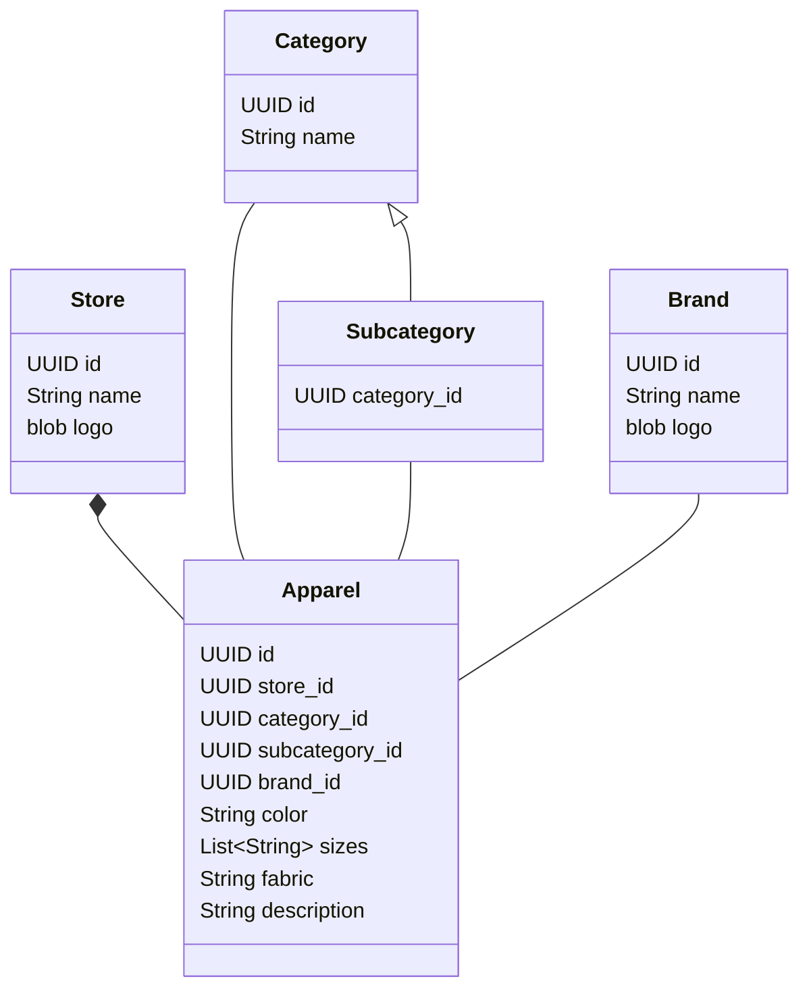

```mermaid
classDiagram
    class Store {
        UUID id
        String name
        blob logo
    }
    class Category {
        UUID id
        String name
    }
    Category <|-- Subcategory
    Subcategory: UUID category_id
    class Brand {
        UUID id
        String name
        blob logo
    }
    class Apparel {
        UUID id
        UUID store_id
        UUID category_id
        UUID subcategory_id
        UUID brand_id
        String color
        List~String~ sizes
        String fabric
        String description
    }
    Store *-- Apparel
    Category -- Apparel
    Subcategory -- Apparel
    Brand -- Apparel

```