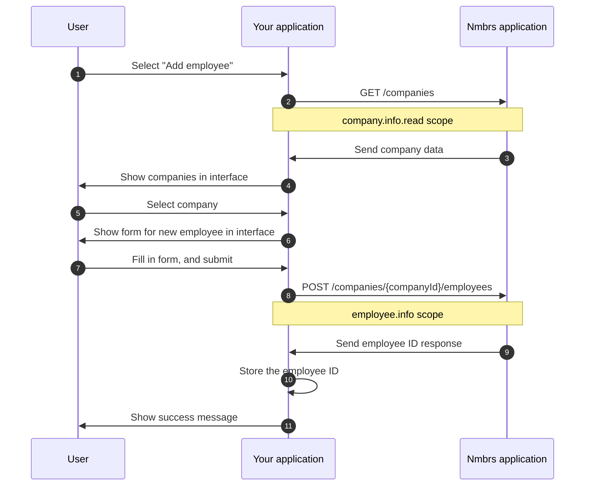
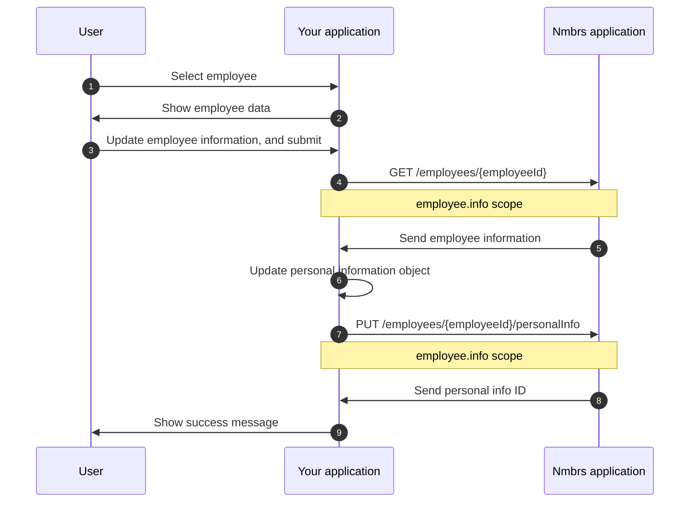

## Introduction

The Nmbrs REST API enables you to sync data between your Human Resources Information System (HRIS) and the Nmbrs application.

This integration guide shows you how to add new employees to the Nmbrs application and how to update an employee’s personal information.

## Prerequisites

- You are connected to the Nmbrs REST API, and have your `subscription_key`. For more information, see [Step by step to connect](https://developer.nmbrs.com/docs).  
- You have implemented the authorization flow. For more information, see [Authentication](https://nmbrs.stoplight.io/docs/nmbrs-restapi/e9e0f5292b4a1-authentication).

## Scenarios

### Add a new employee

{}
To add a new employee, the `access_token` must have at least the `company.info.read` and the `employee.info` scopes. For more information, see [the scopes](https://nmbrs.stoplight.io/docs/nmbrs-restapi/f0f5a1b041408-visma-nmbrs-public-rest-api).
{}

In this scenario, Lisa (Elisabeth) Hanison joins Company 2 as an applicant. A user of your application enters Lisa's details to create a new employee record.

New employees in the Nmbrs application must be associated with a company. The first part retrieves the companies to get the company ID of the company where the user wants to add the employee, and the second part adds a new employee to that company.

To create a new employee, a successful sequence of events between the user, your application, and the Nmbrs application may look as follows:



1. The user selects to add a new employee in your application.
1. Your application requests the companies associated with your Nmbrs account. For more information about the endpoint, see [Get company list](https://nmbrs.stoplight.io/docs/nmbrs-restapi/5fad7a8461a01-get-company-list).
   ```sh
   curl --request GET \
        --url https://api.nmbrsapp.com/api/companies \
        --header 'Accept: application/json' \
        --header 'Authorization: <access_token>' \
        --header 'X-Subscription-Key: <subscription_key>'
    ```
1. The Nmbrs application sends the company data:
    ```json
    {
        "pagination": {
            "pageNumber": 1,
            "pageSize": 20,
            "firstPage": "https://api.nmbrsapp.com/api/companies?pageNumber=1",
            "lastPage": "https://api.nmbrsapp.com/api/companies?pageNumber=1",
            "totalPages": 1,
            "totalRecords": 2,
            "nextPage": "",
            "previousPage": ""
        },
        "data": [
            {
                "companyId": "5b6a77c7-6abe-4f31-93dc-2692169e3ea4",
                "number": "1",
                "name": "Company 1",
                "debtorId": "45d8ad44-ffb8-4691-87d8-7a7a5f4376e9"
            },
            {
                "companyId": "6d4ed88e-7044-42b8-b5f1-606f27873f14",
                "number": "2",
                "name": "Company 2",
                "debtorId": "45d8ad44-ffb8-4691-87d8-7a7a5f4376e9"
            }
        ]
    }
    ```
1. Show the company data to the user.
1. The user selects "Company 2" with `"companyId": "6d4ed88e-7044-42b8-b5f1-606f27873f14"`.
1. Show the new employee form to the user.
1. The user fills in the form and submits the data.
1. Your application makes the request to create a new employee. For more information about the endpoint, see [Create employee](https://nmbrs.stoplight.io/docs/nmbrs-restapi/13c6a8d9c7190-create-employee).
    ```sh
    curl --request POST \
        --url https://api.nmbrsapp.com/api/companies/6d4ed88e-7044-42b8-b5f1-606f27873f14/employees \
        --header 'Accept: application/json' \
        --header 'Authorization: <access_token>' \
        --header 'X-Subscription-Key: <subscription_key>'
        --data '
            {
                "PersonalInfo": {
                    "basicInfo": {
                        "employeeNumber": 98072,
                        "firstName": "Lisa",
                        "firstNameInFull": "Elisabeth",
                        "lastName": "Hanison",
                        "employeeType": "applicant"
                    },
                    "birthInfo": {
                        "birthDate": "1980-02-27",
                        "birthCountryCodeISO": "SE",
                        "nationalityCodeISO": "SV",
                        "gender": "female"
                    },
                    "contactInfo": {
                        "privateEmail": "hanison@private.com",
                        "businessEmail": "hanison@business.com",
                        "businessMobilePhone": "+46763111111",
                        "privateMobilePhone": "+46708999999",
                    },
                    "period": {
                        "year": 2021,
                        "period": 4
                    },
                    "createdAt": "2021-07-01T10:15:08Z"
                }
            }'
    ```
1. The Nmbrs application sends the new employee's ID:
    ```json
    {
        "employeeId": "d30ec597-bd29-453e-9613-7786297eedcc"
    }
    ```
1. Your application updates its local employee record to store the `employeeId`.
1. Your application shows a success message to the user.

### Update an employee’s personal information

{}
To update an employee's personal information, the `access_token` must have at least the `employee.info` scope. For more information, see [the scopes](https://nmbrs.stoplight.io/docs/nmbrs-restapi/f0f5a1b041408-visma-nmbrs-public-rest-api).
{}

In this scenario, the employee Lisa Hanison is now married to Rick Petterson, and she changed her last name to Petterson. A user of your application updates Lisa's personal information.

To update an employee's personal information, a successful sequence of events between the user, your application, and the Nmbrs application may look as follows:



1. The user selects the employee they want to update in your application.
1. Your application shows the employee's data to the user.
1. The user updates the personal information of the employee and submits the data.
1. Your application requests the employee's data from the Nmbrs application. For more information about the endpoint, see [Get an employee](https://nmbrs.stoplight.io/docs/nmbrs-restapi-old/eea078fe0d752-get-an-employee).

    ```sh
    curl --request PUT \
        --url https://api.nmbrsapp.com/api/employees/d30ec597-bd29-453e-9613-7786297eedcc \
        --header 'Accept: application/json' \
        --header 'Authorization: <access_token>' \
        --header 'X-Subscription-Key: <subscription_key>'
    ```
1. The Nmbrs application sends the employee's data.

    ```json
    {
        "pagination": {
            "pageNumber": 1,
            "pageSize": 20,
            "firstPage": "https://api.nmbrsapp.com/api/employees/d30ec597-bd29-453e-9613-7786297eedcc?pageNumber=1",
            "lastPage": "https://api.nmbrsapp.com/api/employees/d30ec597-bd29-453e-9613-7786297eedcc?pageNumber=1",
            "totalPages": 1,
            "totalRecords": 1,
            "nextPage": "",
            "previousPage": ""
        },
        "data": [
            {
                "employeeId": "d30ec597-bd29-453e-9613-7786297eedcc",
                "personalInfo": {
                    "personalInfoId": "756bd0de-fc2f-4b7c-b7ba-d3a3f5360a5b",
                    "basicInfo": {
                        "employeeNumber": 98072,
                        "firstName": "Lisa",
                        "firstNameInFull": "Elisabeth",
                        "lastName": "Hanison",
                        "employeeType": "applicant"
                    },
                    "birthInfo": {
                        "birthDate": "1980-02-27",
                        "birthCountryCodeISO": "SE",
                        "nationalityCodeISO": "SV",
                        "gender": "female"
                    },
                    "contactInfo": {
                        "privateEmail": "hanison@private.com",
                        "businessEmail": "hanison@business.com",
                        "businessMobilePhone": "+46763111111",
                        "privateMobilePhone": "+46708999999",
                    },
                    "period": {
                        "year": 2021,
                        "period": 4
                    },
                    "createdAt": "2021-07-01T10:15:08Z"
                }
            }
        ]
    }
    ```
1. Your application updates the personal information object with the new data provided by the user.
1. Your application makes the request to update the personal information for the employee. For more information about the endpoint, see [Update employee personal information](https://nmbrs.stoplight.io/docs/nmbrs-restapi/e12e45d11695c-update-employee-personal-info).

    ```sh
    curl --request PUT \
        --url https://api.nmbrsapp.com/api/employees/d30ec597-bd29-453e-9613-7786297eedcc/personalInfo \
        --header 'Accept: application/json' \
        --header 'Authorization: <access_token>' \
        --header 'X-Subscription-Key: <subscription_key>' \
        --data '
            {
                "basicInfo": {
                    "employeeNumber": 98072,
                    "firstName": "Lisa",
                    "firstNameInFull": "Elisabeth",
                    "lastName": "Petterson",
                    "employeeType": "applicant"
                },
                "birthInfo": {
                    "birthDate": "1980-02-27",
                    "birthCountryCodeISO": "SE",
                    "nationalityCodeISO": "SV",
                    "gender": "female"
                },
                "contactInfo": {
                    "privateEmail": "hanison@private.com",
                    "businessEmail": "hanison@business.com",
                    "businessMobilePhone": "+46763111111",
                    "privateMobilePhone": "+46708999999",
                },
                "partnerInfo": {
                    "partnerName": "Rick Petterson",
                    "maritalStatus": "married"
                },
                "period": {
                    "year": 2021,
                    "period": 4
                }
            }
    ```
1. The Nmbrs application sends the personal information object's ID.
    ```json
    {
        "personalInfoId": "756bd0de-fc2f-4b7c-b7ba-d3a3f5360a5b"
    }
    ```
1. Your application shows a success message to the user.