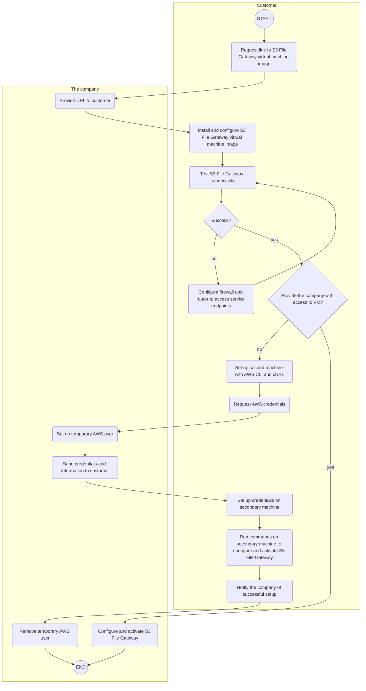

As a customer, you do not have access to the AWS console where the company deploys the components needed for your solution. As a result, certain steps in setting up the S3 File Gateway are executed by a company representative. The following diagram illustrates the stages in the process and who executes them:

