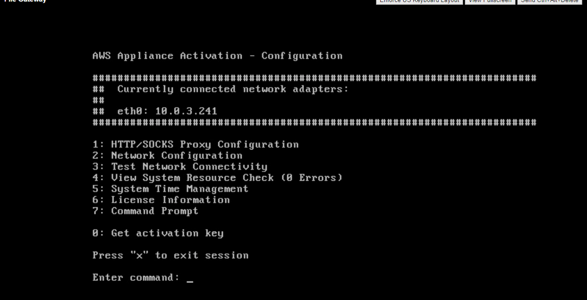

In this stage, you must test the network connection to your S3 File Gateway.

1. Log into your virtual machine. A screen similar to the following is displayed:

   
1. Enter the command to “Test Network Connectivity” and press Enter.
1. Select the “Public” endpoint type and press Enter.
1. Enter the AWS region, which you have received from your designated company representative, and press Enter.
   1. If the test is successful, continue with the procedure.
      

   1. If the test is unsuccessful, then configure your firewall and router to allow traffic from the AWS service endpoints described here: [Allowing AWS Storage Gateway access through firewalls and routers](https://docs.aws.amazon.com/filegateway/latest/files3/Requirements.html#allow-firewall-gateway-access).

      Perform the test again to verify access after the firewall and router configuration.
