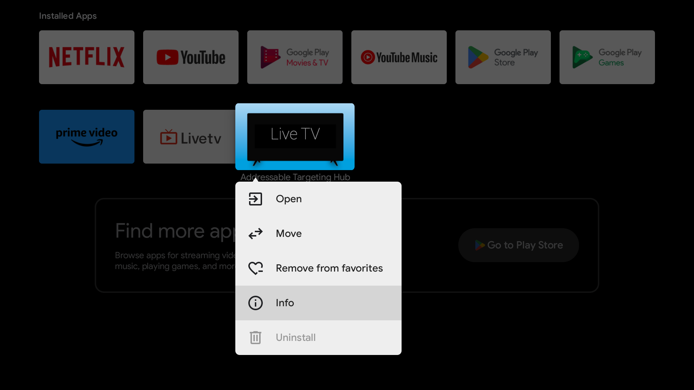
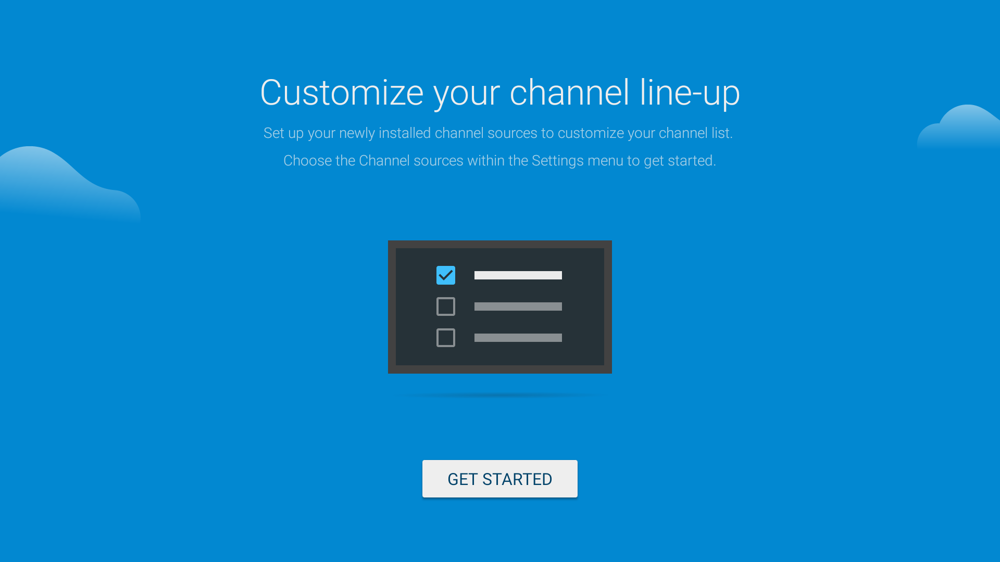
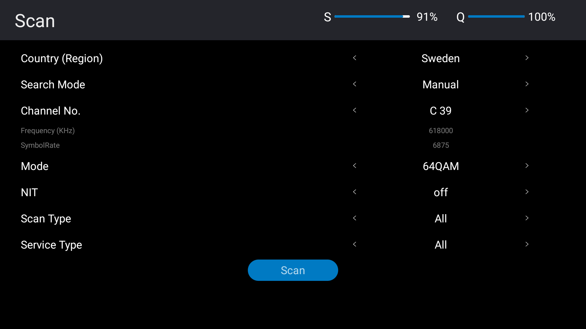

{}
Before you start, make sure the Android TV box is

* connected to a screen,
* connected to your network,
* and connected to the network stream through its input port.
{}

## Enable USB debugging and fetch IP address

Although you connect to the Android TV box over your network, you must enable USB debugging on the Android TV box before you can install the Live TV app through the Android Debug Bridge \(adb\). Follow these instructions:

1. Using the remote control, go into the **Settings** on the Android TV box.
1. In Settings, select **Device Preferences**.
1. In Device Preferences, select **About**.
1. In About, select **Android TV OS build** seven times until you see the message You are now a developer! pop up on the screen.
1. Press the back button on the remote to go back to the Device Preferences menu.
1. In Device Preferences, select **Developer options**.
1. In Developer options, select **USB debugging**, and then select **OK**.
1. Press the back button on the remote to go back to the Device Preferences menu.
1. In Device Preferences, select **About**.
1. In About, select **Status**.
1. In Status, note down the entry under **IP address**, for example, `10.200.0.111`. The IP address is used in a later stage to connect through adb to the Android TV box over your network.
1. Press the back button on the remote until you exit Settings.

You can now connect to the Android TV box over your network, load the configuration file and install the app.

## Upgrade the vendor DTVKit implementation

{}
This stage only needs to be performed when you set up a new Android TV box.
{}

DTVKit provides an interface that allows live TV applications, such as Live TV app, to scan and show digital TV broadcasts on an Android TV box.

Follow these instructions to upgrade the vendor DTVKit implementation:

1. Download the [dtvkitserver](../../../downloads/dtvkitserver) package.
1. Enter the following command from the terminal to connect to the Android TV box:

   ```
   adb connect <IP address of your Android TV box>
   ```

   For example:

   ```
   > adb connect 10.200.0.111
   connected to 10.200.0.111:5555
   ```
1. Enter the following command to assume root permissions on the Android TV box:

   ```
   adb root
   ```
1. Enter the following command to make the /system partition on the Android TV box writable:

   ```
   adb remount
   ```
1. Enter the following command to upgrade the vendor DTVKit:

   ```
   adb push <local path to dtvkitserver file> /vendor/bin/hw
   ```
1. Enter the following command to reboot the Android TV box:

   ```
   adb reboot
   ```
1. After the Android TV box has rebooted, reconnect to the device:

   ```
   adb connect <IP address of your Android TV box>
   ```
1. Enter the following command to open an interactive shell on the Android TV box:

   ```
   adb shell
   ```
1. Enter the following command to browse to the vendor DTVKit location:

   ```
   cd /vendor/bin/hw
   ```
1. Enter the following command to verify the version of the new vendor DTVKit:

   ```
   file dtvkitserver
   ```

   The output of this command should be as follows:

   ```
   build:dtvkitserver: ELF shared object, 32-bit LSB arm, 
   dynamic (/system/bin/linker), for Android 31, 
   BuildID=8a9e61ee3ce6eda78350b7a0dc44b5f6
   ```
1. Enter the following command to exit the interactive shell:

   ```
   exit
   ```
1. Enter the following command to disconnect from the Android TV box:

   ```
   adb disconnect <IP address of your Android TV box>
   ```

   For example:

   ```
   > adb disconnect 10.200.0.111
   disconnected 10.200.0.111:5555
   ```

## Create and load configuration file

{}
The company recommends to label all your Android TV boxes, keep a copy of the configuration file for each Android TV box, and keep a record of which Android TV box, through its label, matches which configuration file. This allows you to easily replace an Android TV box with a new one, for example, in case it breaks, and upload the appropriate configuration file.
{}

The Live TV app requires a configuration file to be present on the Android TV box to make ad requests for the correct network and region the Android TV box is assigned to. Follow these instructions before installing the Live TV app:

1. Create a plain text file on your computer containing the following information:

   * `pid`: the Personal IDentifier, which is used to identify the Android TV box to the ad insertion service. The `pid` must be unique across all the Android TV boxes where you install the Live TV app. We recommend to use a numerical value, for example `0001`.
   * `channel`: the channel that this Android TV is tuned to. The name must match the exact name of the network stream as it is used in the targeting on the ad campaigns.
   * `region`: the region that this Android TV serves. The name must match the exact name of the region as it is used in the targeting on the ad campaigns.
   * `account`: the subdomain of your product account.
   * `logo_position`: the position where the channel logo is shown during ad playback. Possible values are: `top-left`, `top-right`, `bottom-left`, or `bottom-right`. The default value is `top-right`.
   
   For example:

   ```
   pid=0001
   channel=channel1
   region=region1
   account=in-rel-demo
   logo_position=bottom-left
   ```
1. Save the file with the name `company.properties`.
1. Enter the following command from the terminal to connect to the Android TV box:

   ```
   adb connect <IP address of your Android TV box>
   ```

   For example:

   ```
   > adb connect 10.200.0.111
   connected to 10.200.0.111:5555
   ```
1. Enter the following command to push the configuration file to the Android TV box in the `/sdcard/Download/` location:

   ```
   adb push <local path to company.properties file> /sdcard/Download/
   ```

   For example:

   ```
   > adb push /Users/XXX/Desktop/box2/company.properties /sdcard/Download/
   /Users/XXX/Desktop/box2/company.properties: 1 file pushed, 0 skipped. 0.0 MB/s (65 bytes in 1.127s)
   ```
1. Enter the following command to disconnect from the Android TV box:

   ```
   adb disconnect <IP address of your Android TV box>
   ```

   For example:

   ```
   > adb disconnect 10.200.0.111
   disconnected 10.200.0.111:5555
   ```

## Install app

{}
Make sure you have the latest version of the Live TV app on your computer. If not, contact your designated company representative and request the latest version.
{}

In this stage, you install the Live TV app. Follow these instructions:

1. Enter the following command from the terminal to connect to the Android TV box:

   ```
   adb connect <IP address of your Android TV box>
   ```

   For example:

   ```
   > adb connect 10.200.0.111
   connected to 10.200.0.111:5555
   ```
1. Enter the following command to install the Live TV app, and wait until you see the success message:

   ```
   adb install -r -g <local path to the Live TV app>
   ```

   For example:

   ```
   > adb install -r -g ~/Desktop/live_0.1.4.apk
   Success
   ```

   In this command the flags have the following meaning:

   * `-r`: this flag is used to reinstall an existing app while keeping the data from the previous installation.
   * `-g`: this flag is used to automatically set all permissions that are needed by the app.
1. Wait for 30 seconds after receiving the `Success` message on the command line before you continue with the procedure.
1. Enter the following command to disconnect from the Android TV box:

   ```
   adb disconnect <IP address of your Android TV box>
   ```

   For example:

   ```
   > adb disconnect 10.200.0.111
   disconnected 10.200.0.111:5555
   ```
1. Using the remote, browse to the Live TV app, and long press the select button. The context menu appears:

   
1. From the context menu, select **Info**. The Live TV menu appears:

   
1. In the Live TV menu, check that the version number of the installed app matches the version you installed on the Android TV box through the adb command.

   You may be handling many Android TV boxes, so this verification step is important to ensure you are executing the rest of the procedure on the same device.

   
1. On the remote, press the back button until you are back in the home screen.

## Configure app

In this stage, you configure the Live TV app to tune to the correct network. Follow these instructions:

1. Using the remote, browse to the Live TV app and launch it. The Live TV app screen appears:

   
1. Keep clicking on next \(\>\) until the GET STARTED screen appears:

   
1. Select **GET STARTED**. The Set up your sources screen appears:

   
1. <a name="channel_setup"></a>Select **DTVKit2**. The channel setup screen appears:

   
1. Set up the following fields:
   * Country \(Region\): select the country or region.
   * Search Mode: select Manual.
   * Channel No.: select the channel to which the app needs to be tuned.
     * Frequency \(KHz\): the frequency changes according to the selected channel. Do not manually change this setting.
     * SymbolRate: set the symbol rate to align with the symbol rate of your QAM modulator in kilo symbols/second. For example, if the symbol rate is 6,900,000 symbols/second, then SymbolRate needs to be set to 6,900.
   * Mode: select the correct modulator constellation according to the modulator used for the input stream. For example, 64QAM.
   * NIT: select off.
   * Scan Type: select All.
   * Service Type: select All.
1. Select **Scan**. The screen changes for a brief time to a scanning screen and then returns to the channel setup screen.
1. Verify that S \(Strength\) and Q \(Quality\) are both 90% or more on the channel setup screen. If the values are not 90% or more, then adjust SymbolRate to the correct value and select **Scan** until S and Q are both 90% or more.
1. Using the remote, click the back button to return to the Set up your sources screen.

   
1. Select **Done**.
1. Press the back button until you are back on the home screen of the Android TV box.
1. Relaunch the Live TV app to verify that the app is correctly set up and you can see the network you have configured.

## Disable Developer options

For security reasons, Developer options must be disabled after you have successfully installed and configured the Live TV app. Follow these instructions:

1. Using the remote control, go into the **Settings** on the Android TV box.
1. In Settings, select **Device Preferences**.
1. In Device Preferences, select **Developer options**.
1. In Developer options, next to **Enable developer options**, select the toggle to disable Developer options.
1. Press the back button until you are back on the home screen of the Android TV box.
1. Relaunch the Live TV app.
